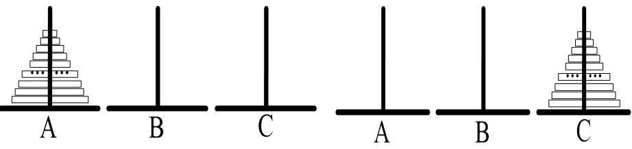

# <center>C语言程序设计
**<center>大一上期末知识考点汇总**

**张衍维**</center>

**<font size=5>目录:</font>**
[TOC]

---------------------------------------
## 一.进制转化
### 在十进制转换成其他进制的时候

**整数除进制取余，小数乘进制取整**

**注意次序**，整数是**逆次**相取，小数是**顺次**相取


### 其他进制转化为十进制
**注意:第一位从0次方开始**


--------------------------------------
## 二.数据处理

### 把数据存入文件

存入文件需要文件指针类型`FILE*`来进行操作

要想写进文件,首先我们要创建**文件指针**

```C
#include <stdio.h>
int main() {
	FILE* fp;
	errno_t err = fopen_s(&fp, "oppo.txt", "w");
    if (err != 0) {
		printf("没读到");
		return -1;
	}
	/*
	这是微软VS特有的文件打开方式,不得不品鉴...
	其实你也可以写成更简单的形式:

	FILE* fp=fopen("filename","w");
   
	//同一文件夹下可以写相对路径,不同文件夹要写绝对路径(从C盘开始写...)
	if(fp==NULL)
	{
		perror("open file failed:");    
		return -1;
	}//在文件无法打开时弹出提示以及错误原因。
	//随手关针好习惯
	fclose(fp);
	*/
	fclose(fp);
    return 0;
}
	
```
打开了文件后接下来的步骤如下一个标题所示:

### 产生特定范围内的随机小数或整数

产生随机数需要`rand()`函数

`rand()`函数实际上是伪随机数,即本质是通过一个函数算出来的,因此我们使用不断变化,不可能重复的时间就可以保证函数输出的值不重复

同时要记住

通过`<stdlib.h>`来使用rand()函数

>#include <stdlib.h>

需要用到`<time.h>`库来获取当前时间

>#include <time.h>

对于**小数**来说,要通过除以`RAND_MAX`来获得位于(0,1)区间的小数,然后再通过`*`获得合适的区间长度,通过`+`获得合适的区间位置
```	C
//随机数发生器的初始化函数srand()
srand(time(0));
int n = 5;
for (int i = 0;i <= n;i++) {
	double b = ((double) rand()) / RAND_MAX *100+100;
	fprintf(fp,"%lf\n",b);
}
```
对于**整数**来说是取余`%`来获得规定区间，然后再通过`+`调整位置
```C
srand(time(0));
int n = 5;
for (int i = 0;i <= n;i++) {
	int b = ((int) rand())%100+100;
	fprintf(fp,"%d\n",b);
}
```
<br>

### 数组排序

#### 按照ASCII码进行排序
不知道什么是ASCII码的[点这里](#ascll码 "这个真得掌握"),虽然这里使用`strcmp`没有直接展现整数与字符的对应关系

**作业EXP2 work2:**

>The strings like: "Pascal","Basic","Fortran", "Java","Visual C", ”Bad”, ”Force”, and so on. Please sort these strings in dictionary order using pointer and print it.  

说白了就是按照字母各自的**ASCII码排序**

将**字符串**作为参数传递给函数需要用到指针`char*`

如果不知道其中`strcmp()`等函数的话[点这里](#有关结构体的函数 "还等什么快点啊")

```C
#include <stdio.h>
#include <string.h>
//交换指针要用指针的指针
void swap(const char** a,const char** b) {
    const char* temp = *a;
    *a = *b;
    *b = temp;
}
int main() {
    int n = 7;
    //注意字符串的定义方式,对于恒定的字符使用恒定的字符指针const char*,指针记录的即是每一项开始时的地址
    const char* A[] = { "Pascal", "Basic", "Fortran", "Java", "Visual C", "Bad", "Force" };
    for (int i = 0; i < n - 1; i++) {
        for (int j = 0; j < n - i - 1; j++) {
            if (strcmp(A[j], A[j + 1]) > 0) {
                swap(&A[j], &A[j + 1]);
            }
        }
    }
    printf("Sorted strings in dictionary order:\n");
    for (int i = 0; i < n; i++) {
        //可以用%s以字符串形式直接输出
        printf("%s", A[i]);
        if (i < n - 1) {
            printf("\n");
        }
    }
    return 0;
}
```
<br>

#### 按照数的大小进行排序

没啥好说的,前面的例题里面有排序的一种方法,这里再给一种思路

主要思路:**冒泡排序**
```C
bool flag = true;
while (flag) {//对数组进行排序，这里使用的是冒泡排序，主要的思路就是把相邻逆序的大数与小数交换位置
	flag = false;//重置flag，若一次都没换，证明数列的排序已经完成了，可以break了
	for (int i = 0; i < LEN; i++) {
		if (num[i] > num[i + 1]) {
			int temp = num[i + 1];//如果发现前一个数大于后一个数就,交换
			num[i + 1] = num[i];
			num[i] = temp;
			flag = true;//表示本次交换了，未完成排序
		}
	}
}
```


<br>


### 数据储存到数组
#### 数组的初始化
```C

char str[]= “QUEST”;
char *str= “QUEST”;//指针的初始化
char str[]={‘Q’, ‘U’, ‘E’, ‘S’, ‘T’, ‘\0’};
char str[10][10]={0}//将局部变量数组初始化为0,多少维都可用,局部变量不像全局变量，全局变量如果没初始化，那么默认是全 0。
```
注意,以下是不对的
```C
char str[5]= “QUEST”;
```
因为数组的最后一位一定要留给`\0`
#### 从文件中读取到数组(不考)

tips:读取文件中的数据并存入数组在本次考试中不涉及,具体方法如下:

` ()`:没啥好说的,和`scanf()`差不多
```C
int grades[10];
for (int i = 0; i < 10; i++) {
    fscanf(fp,"%d", &grades[i]);
	//使用fscanf读取数据并用for循环以整形的形式存到grades数字里面
}
fclose(fp);//及时关掉文件
```
或者用`fgets`,注意`fgets()`提取的是**单个字符**,`char`类型
更要注意`fget()`读到**第(LEN-1)时就停止了**
```C
fgets(a, LEN, fp);
//fgets(数组地址起点,读取字符个数,指针)
fclose(fp);
```

#### 从键盘里读取到数组中
这里有几个方案可以选择

`gets()`:由标准设备输入(人话:键盘),获得字符类型`char`,多少无限制,别爆了就行
```C
#include <stdio.h>
int main(void)
{
    char str1[5];
    gets_s(str1);
    printf("%s\n", str1);
    return 0;
}
```

`getchar()`:getchar其实返回的是字符的ASCII码值(整数),每次从缓冲区中读取**一个字符**后结束

```C
//getchar()要赋值给ch,特殊字符要加" "
while ((ch = getchar()) != '\n') {
	if ((65 <= ch && 90 >= ch) || (97 <= ch && ch <= 122) || ch == 32) {
		//Note that the input of spaces should also be read in
		A[i] = char(ch);
		i++;
	}
}
```
`scanf()`:标准化输入,你最熟悉的,通过for循环来依次输入
<br>

### 二维数组

**作业ASSI2 work2**
>There be a 4×5 matrix as shown below: 
 
Please write a program to complete the following: 
>1. Sum of all elements. 
>2. Find all elements that are greater than the average.

处理高维数组的思路:

**通过两个for循环遍历所有元素**


```C
#include <stdio.h>
int main() {
	//二维数组使用花括号,括号之间使用逗号隔开
	int A[4][5] = {
	{2,6,4,9,13},
	{5,-1,3,8,7},
	{12,0,4,10,2},
	{7,6,-9,5,3}
	};
	int sum = 0;
	//二维数组通常通过两个for循环遍历所有元素
	for (int i = 0;i <= 3;i++) {
		for (int j = 0;j <= 4;j++) {
			sum = sum + A[i][j];
		}
	}
	printf("sum is %d\n", sum);
	printf("num larger than aver:");
	double aver = sum / 20;
	//同样通过两个for循环遍历
	for (int in = 0;in <= 3;in++) {
		for (int jn = 0;jn <= 4;jn++) {
			if (A[in][jn] > aver) {
				printf("%d ", A[in][jn]);
			}
		}
	}
	return 0;
}
```

放心即可,对于马鞍点类似的难度不会出现在考题中

因此仅仅粘贴下马鞍点的题目和本人代码提供给大家参考,不必过于认真
>Compute Saddle Point Problems of 2D Arrays. Find the "saddle point" with the m-row n-column two-dimensional array Array, where the element at that position is the largest on the row, the smallest on the column. Such as:
>
>The “42” is the saddle point.


```C
#include <stdio.h>
int main() {
	//Read the information of the array from the file and save it to array A
	FILE* fp;
	errno_t w=fopen_s(&fp, "HAHA.txt", "r");
	if (w !=0) {
		perror("error is");
		return 1;
	}
	int A[10][10] = {0};
	for (int i = 0; i <= 9; i++){
		for (int j = 0; j <= 9; j++){
			fscanf_s(fp, "%d ", &A[i][j]);
		}
	}
	int row_max, column_min, c, cl, rowm[10], colm[10];
	//the largest on the row
	for (int i = 0; i <= 9; i++) {
		row_max = A[i][0];
		for (int j = 0; j <= 9; j++) {
			if (row_max <= A[i][j]) {
				row_max = A[i][j];
				c = j;
			}
		}
		//check whether its the smallest on the column
		cl = A[i][c];
		for (int in = 0; in <= 9; in++) {
			if (A[in][c] < cl) {
				cl = A[in][c];
			}
		}
		if (cl==A[i][c]) {
			printf("one of the saddle point is found at position:[%d,%d]\n", i,c);
			printf("the number of it is:%d\n", A[i][c]);
		}
	}
	fclose(fp);
	return 0;
}
```
<br>


### 数学公式

我猜你一定需要这个库:`<math.h>`

接下来的主要函数都要**以这个库为基础**,注意使用公式的时候**加上头文件**
```C
#include <math.h>
```

#### 阶乘
$$
n!=\prod_1^n x
$$
```C
double factorial(int n)
{
	double sum = 1;
	for (int i = 1;i <= n;i++) {//没有使用递归的原因是因为调试递归的时候栈爆了。。。。
		sum *= i;//使用for循环进行阶乘计算
	}
	return sum;
}
```
#### 指数运算
$$
a=x^n
$$
```C
a=pow(x,n);
```
$$
a=\sqrt{x};
$$
```C
a=sqrt(x);
```
#### 绝对值
$$
a=|x|
$$
```C
a=abs(x);
```
#### 三角函数
```C
a=sin(x);
b=cos(x);
c=tan(x);
```
#### 积分
$$
\int_{min}^{max}ax^2+bx+cdx
$$
```C
//使用几何意义求积分,即细微面积的和
//细分的n越大越精准,但是不能过大导致溢出
int n = 1000000000;
delta = (max - min) / n;
for (int i = 0; i < n; i++) {
	double x = min + i * delta;
	sum =sum+ a * x  *x + b * x + c;
}
```
<br>

### 变量类型
#### static静态变量
1.作为**静态局部**变量时：
```C
#include <stdio.h>
void haha(){
	static int cout =0;
	cout++;
	printf("函数调用次数%d\n",cout);
}
int main(){
	haha();
	haha();
	return 0;
}
```
**运行结果**
>函数调用次数1
函数调用次数2

可以看出:
- **只初始化一次，再不运行**
- 存活时间长，出函数**不会被销毁**
- 局部变量在主函数中照样不能用:

2.作为**静态全局**变量（函数）时：
只可以使其在声明所在的文件内可见，无法被外部调用

#### 动态局部变量
占动态存储空间，函数调用结束后即释放，在它作用域之外不能使用。

人话就是你一直在用的变量类型,没啥好说的

#### 全局变量
定义在函数之外,全局有用,在使用的时候需要加上`extern`来调用

```C
#include <stdio.h>
int main(void)
{
	//声明要调用全局变量
    extern int X;
    return 0;
}
//定义全局变量
int X = 10;
```

#### define定义
预处理指令,用于定义符号常量或宏‌

人话就是用后面的东西**完完全全替换掉**前面的东西

```C
#define PI 3.1415926
```

<br>

### 其他要注意的点
#### ASCII码
想要实践点[这里](#按照ascll码进行排序 "逝逝吧")和这里的[getchar()](#从键盘里读取到数组中 "来逝逝")

ASCII码将字符编码为数字的标准

人话就是一个数对应唯一一个字符

记住以下两个就足够了,还要记住英文单词有26个字母

|字符|A|a|
|----|---|---|
|对应的ASCII码|65|97|

#### 数组与scanf()
`%s`后面跟着地址 如`scanf(“%s”,&a)`,但是对于数组来说本身就是第一个数组,就可以使用`scanf(“%s”,A)`即可
#### 数组长度
**无论如何,数组的最后一位都是`\0`**

也就是说`arr[5]`最多能放下四个字符
#### ++a和a++

`++a`:先++后再用

`a++`:先使用a,等语句计算结束后再++

```C
#include <stdio.h>
#include <string.h>
int main(){
	int a,b,c;
	a=1;
	b=++a+1;
	a=1;
	c=a+++1;
	printf("%d\n",b);
	printf("%d",c);
	return 0;
}
```
**运行结果**
>3
2

#### 如何用函数返回多个值	

众所周知,`return`只能返回**一个值**

方案:

使用**全局变量**,外部声明,用`extern`调用,还不知道的[点这里](#全局变量 "一猜你就是跳着看的")

使用**指针**,通过函数指针修改地址达到传递值的,上面有实际应用的[例子](#按照ascll码进行排序 "指针的指针"),对于指针不知道的[点这里](#三指针- "别着急,着急也不会")

结构体指针

#### 找平均值(调用数组)
用for循环遍历,没啥好说的

#### sizeof()和strlen()区别
`sizeof()`是计算数据类型所占空间大小,比如计算指针类型占多少字节(指针保存地址，指针大小即电脑上地址的大小)
```C
#include <stdio.h>
#include <string.h>
int main(){
	printf("%u",sizeof(int*));
	//%u是无符号整型
	return 0;
}
```
**运行结果**
>8

而`strlen()`是计算数组的长度,直到`\0`为止,需头文件`<string.h>`
```C
#include <stdio.h>
#include <string.h>
int main(){
	char A[10]={'a',' ','2','b','\0','1','4'};
	//包括空格
	printf("%s",A);
	printf("\n%zd",strlen(A));
	//都是到`\0`为止
	return 0;
}
```
**运行结果**
>a 2b
3

#### 逻辑运算符

|a或b|a和b|非|
|---|---|---|
|a\|\|b|a&&b|!a|

```C
x>y?x:y
```
它的意思是,如果 x > y 为真,则返回 x;否则返回 y


#### switch
```C
switch(表达式) {
    case 常量表达式1: 
        语句序列1;
    case 常量表达式2: 
        语句序列2;
    ...
}
```
switch后面的括号里的表达式会被计算一次

计算结果与case标签中的常量表达式进行比较后决定是否执行

**因此一定会有一个case语句**
<br>

******************************
## 三.函数思维

对于函数最重要的就是

**对于侧重过程的C语言,你干了什么就在函数里写什么**

多多使用函数能任务模块化,分步进行,提升代码重复利用率,极大的降低难度

**记住,你要干什么,就写个函数单独干这事**

### AASI2 work4
>Write a simulated voting system in which 20 people want to vote for 3 people. The number of votes and abstentions for each person is counted, and the results are output to the screen.
Analysis: The voting results can be saved in the array int candidate[4], candidate[1]~candidate[3] are the votes obtained by three different candidates respectively, candidate[0] is the number of abstention votes; use the array int vote[n] to save n The voting result of each voter. The voting result value i is the vote for the i-th person (i=1,2,3). If i is other value (i≠1,2,3), it means abstention.
Design two functions:
>1. void vInput (int n, int v[]): Save the voting results of n people into the array v.
>2. void prtResult (int n, int p[], int v[]): Count n voting results v[n] by candidate p[i], and output the voting results. 
```C
#include <stdio.h>
void vInput(int n, int v[]);
void prtResult(int n, int p[], int v[]);
int main() {
	int n=20,candidate[4], vote[20];
	printf("The voting result of each voter:\n");
	vInput(n, vote);
	prtResult(n, candidate, vote);
	return 0;
}
//将n人的投票结果保存到数组v中
void vInput(int n,int v[]) {
	for (int i = 0;i <= n - 1; i++) {
		scanf_s("%d", &v[i],100);
	}
}
//统计候选人p[i]的n个投票结果v[n]，并输出投票结果
void prtResult(int n, int p[], int v[]) {
	int sum1 = 0, sum2 = 0, sum3 = 0, sum0 = 0;
	//遍历,分票
	for (int i = 0;i <= n - 1; i++) {
		if (v[i] == 1) {
			sum1++;
		}
		else if (v[i] == 2) {
			sum2++;
		}
		else if (v[i] == 3) {
			sum3++;
		}
		else {
			sum0++;
		}
	}
	if (sum1>= sum2&&sum1>=sum3) {
		printf("1 victory!\n");
	}if (sum2 >= sum1 && sum2 >= sum3) {
		printf("1 victory!\n");
	}if (sum3 >= sum1 && sum3 >= sum2) {
		printf("1 victory!\n");
	}
	printf("each of them is:\npeople 1:%d\npeople 2:%d\npeople 3:%d\nabstention:%d",sum1,sum2,sum3,sum0);
}
```
### The Tower of Hanoi
理清楚每一步干了什么

干一步写一个函数
> The Tower of Hanoi game evolved from an ancient legend: there are three pillars A, B, and C. On pillar A, n plates with holes in the middle are placed in order of size, as shown in Figure (a).   Now we need to move these n plates from pillar A to pillar C, as shown in Figure (b).
> 
> During the moving process, you can use the B-pillar in the middle to stipulate that only one plate can be moved at a time, and during the moving process of the plate, the large plate can only be under the small plate. How can this be accomplished with the minimum number of moving steps? Please write a program that gives the steps to complete the Tower of Hanoi game.
```C
#include <stdio.h>
void move(char a, char b);
void hanoi(int n, char a, char b, char c);
int main() {
	int n;
	printf("层数为：");
	scanf_s("%d", &n);
	hanoi(n,'A', 'B', 'C');
	return 0;
}
//这个函数用来进行盘子的转移
void move(char a, char b) {
	printf("%c--->%c\n",a,b);
}
//hanoi的基本运行规律
//递归,其中的参数是(盘子的数量,从哪里开始,经过那里,最终到哪里)
//a,b,c分别为对应的三个柱子,柱子本身的名称不变
void hanoi(int n,char a,char b,char c) {
	//终止条件,直到最后的一个盘子
	if (n == 1) {
		move(start,end);
	}
	else {
		//函数会自身引用自身,使用n进行
		//从a出发,经过c的协助,最终落在b
		hanoi(n - 1, a,c ,b);
		//然后将大盘子移到目标点
		move(a, c);
		//再把剩下的那俩移到最右边去
		hanoi(n - 1, b, a, c);
	}
}
```


*******************************
## 四.指针 *
### \*的作用
在**定义**的时候意为后方变量为指针变量int\* a

在**使用**的时候意为取该地址所存的字符&a=p;*p=a
<br>

### 步长

指针指**一个整体**,+1表示指**向下一整个数据**,其距离就是**步长**

一个int为4字节
```C
#include <stdio.h>
#include <string.h>
int main(){
	int* p;
	int a = 6;
	p = &a;
	printf("%p\n",p);
	printf("%p",p+1);
	//%u是无符号整型
	return 0;
}
```
**运行结果**
>000000AE91CFFC24
000000AE91CFFC28

一个double有8个字节
```C
#include <stdio.h>
#include <string.h>
int main(){
	double* p;
	double a = 6;
	p = &a;
	printf("%p\n",p);
	printf("%p",p+1);
	//%u是无符号整型
	return 0;
}
```
**运行结果**
>0000006D199AFA08
0000006D199AFA10


<br>

### 指针的++,()和++

\*p++:表示指针所指的的地址**移向下一个地址**；

(\*p)++:表示指针**所指的值**++;

++\*p和++(\*p)同理上文++a

指针的指针使用**

### 其他
本质上两个for循环实际上也是具有指针的思维,比如处理[二维数组](#二维数组 "挺长的,认真看吧")的时候

还有就是前文提到的[双指针](#按照ascii码进行排序 "有点难,还好吧")

**********************************
## 五.结构体struct

### 定义
```C

//Student此时是类型
struct Student {
    char name[50];//只有在初始化的时候使用
    int age;
    float score;
}t1,t2;
//此时就已经定义了t1和t2
```
```C
struct Student {
    char name[50];]
    int age;
    float score;
}DATE;
int main(){
	DATE h={"ASD",6,3.14};
}
```
```C
//或者换一种方式进行定义
//注意结尾加上冒号!
struct Student {
    char name[50];
    int age;
    float score;
};
int main(){//使用花括号进行初始化
	struct Student t1={"Gelo",45,3.1415};
}
```
<br>

### 结构体数组
#### 访问元素并操作
使用`. `来对其进行访问
```C
t1.age//调用age,除数组之外还可以给其赋值
```
使用`->`进行指针的访问
```C
struct complex
{  float f;};
void func(struct conmplex* cp);
```
`cp->f`等同于`(* cp).fs`
#### 查找，排序
可以访问后就可以按照之前查找和排序的思路进行
```C
struct Student {
    char name[50];
    int age;
    float score;
};
int main(){
	int max=0;
	struct Student t[3]={{"Gelo",45,3.1415},{"dare",10,2.65},{"wlpor",100,95.2}};
	for(int i=0;i<=3;i++){
		if(t[i].age>max){
			max=t[i].age;
			k=i;
		}
	}
}
```


<br>

### 有关结构体的函数
一定要记得加上`<string.h>`的头文件

#### strcpy()

**字符串复制**函数

将后面str2的一串字符复制粘贴到前面str1
```C
strcpy(str1,str2)
```

#### strcmp(a,b)
用于比较两个字符串并根据比较结果返回不同的整数值
```C
int strcmp(const char* a, const char* b);
```
- 字符相等,返回\0
- a \< b 时,则返回一个小于0的值
- a \> b 时,则返回一个大于0的值

上文有[实践例子](#按照ascii码进行排序)
<br>

### 其他注意事项

**结构体之间的赋值不能直接写等于号“=”**

**结构体内的数组只能通过初始化赋值**

结构体本身是可以嵌套的

***********************************
## 六.链表(不考)
不考,嘻嘻

还有就是我不会,让会写的人来写这一段吧
